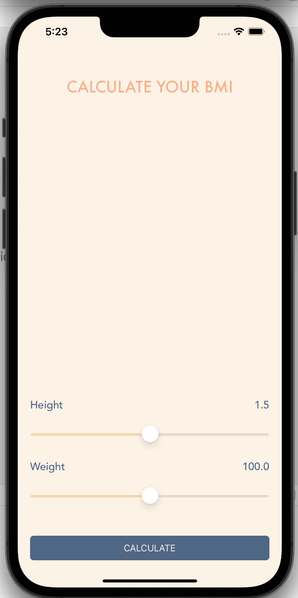
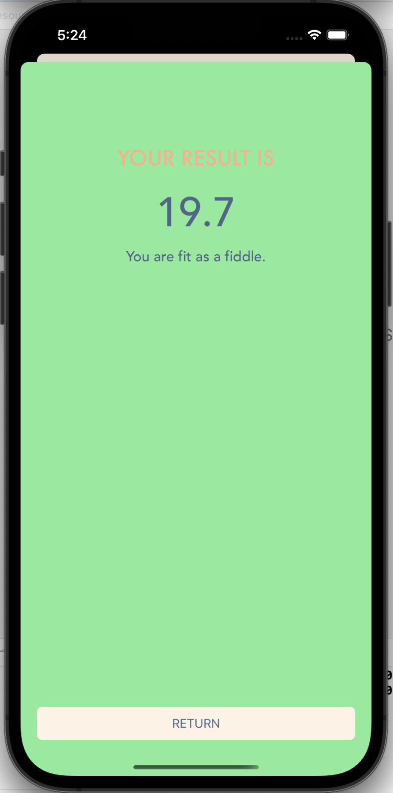
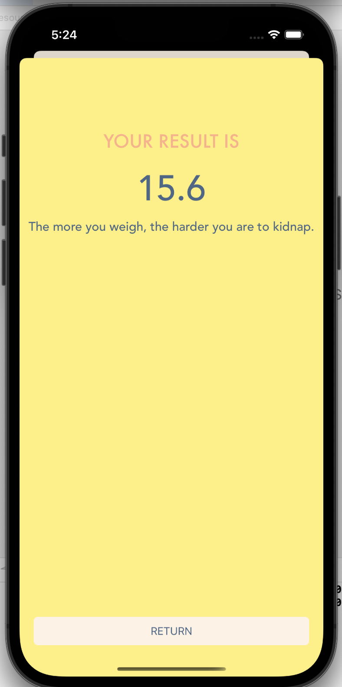
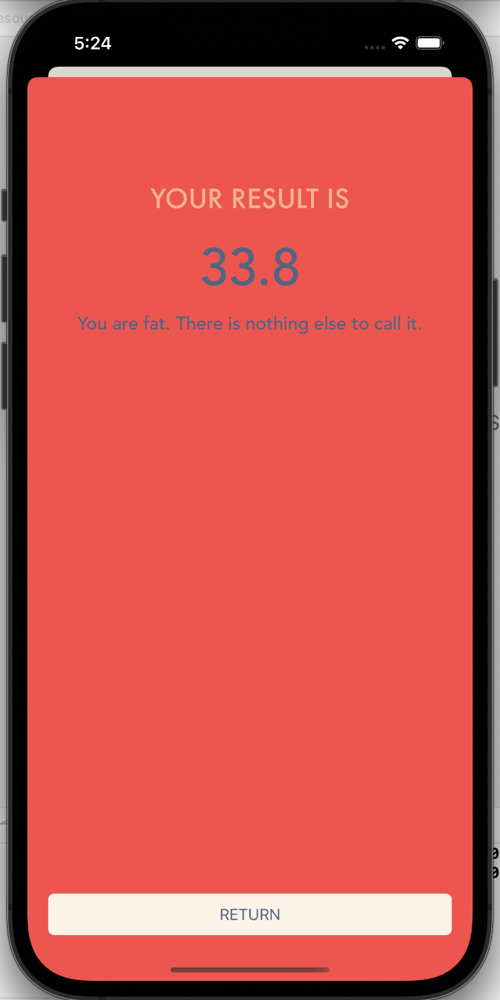

# Xylo 

BMI Calculator is an app built for iphone and ipad in swift. The app follows the MVC design
pattern. The views are built programmatically and not using the interface builder.

* **Use** the slider to set your height and weight.
* **Press** calculate to get the result.
* **Check** your result and get a message regarding your BMI.

## Technologies used in this project:

 

## User interface:

Use sliders to set the value and press calculate to get the result based on your input values.

  

The result screen turns **green** if your BMI is in the normal range.

  

The result screen turns **yellow** if your BMI is below the normal range.

  

The result screen turns **red** if your BMI is above the normal range.

  

## Note

Feel free to download the project and build upon it. You can add
new features, refactor the code if you'd like and improve 
the overall experience. Happy coding!